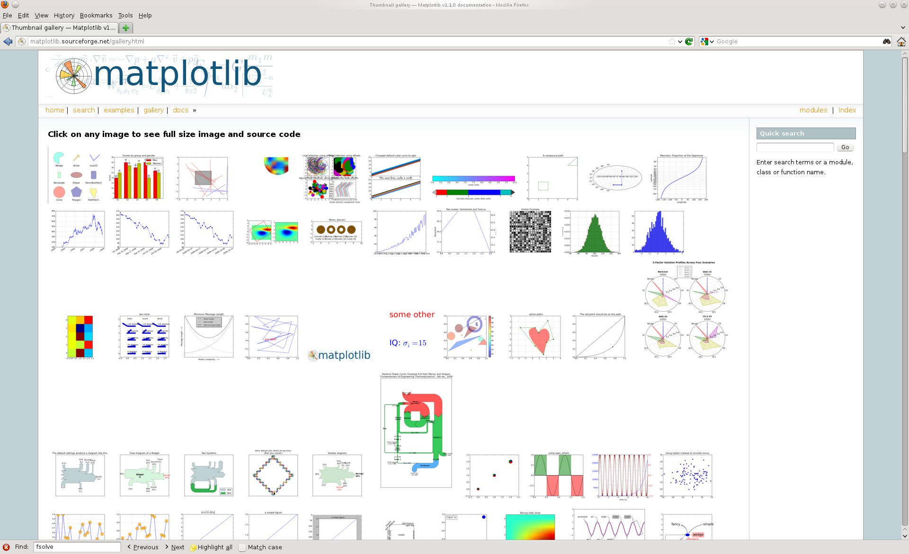
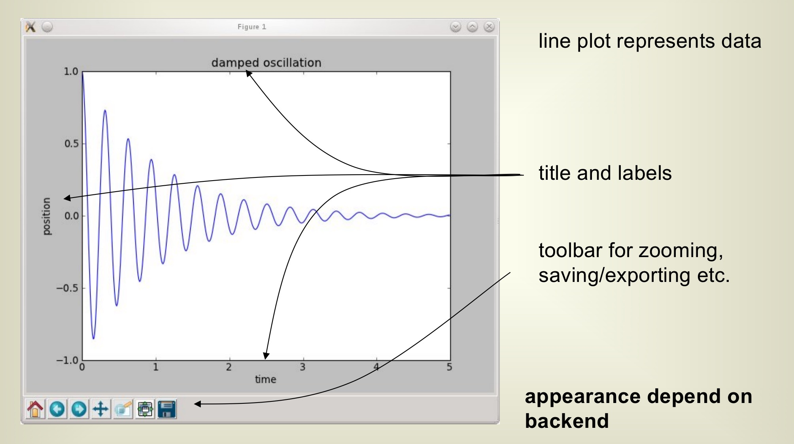
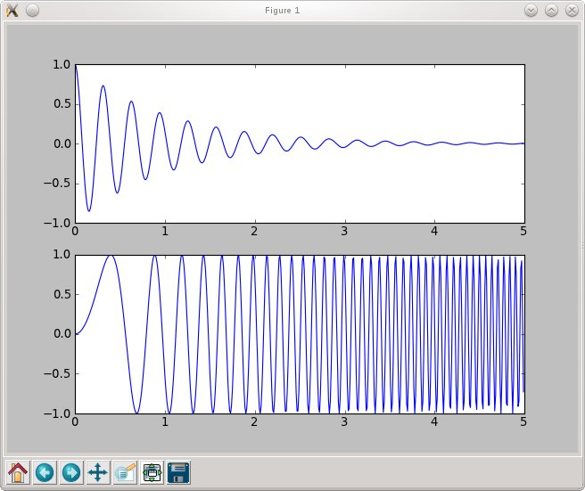
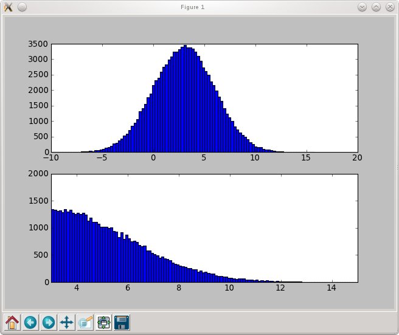
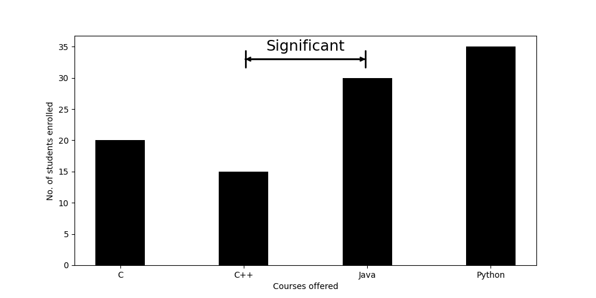
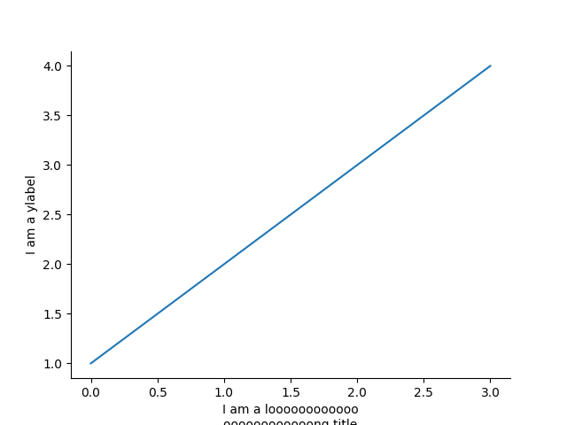
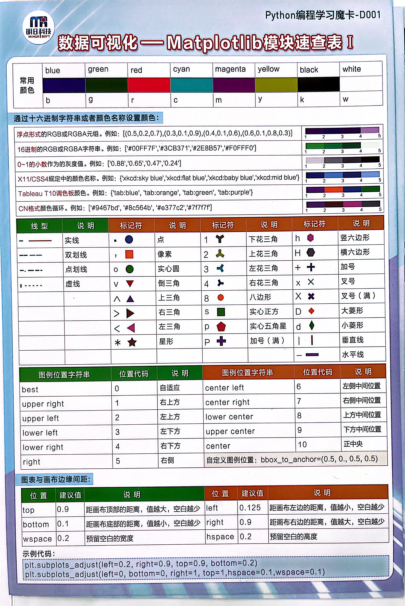

# Graph with Matplotlib
## by Jibo He
清华大学社会科学学院心理学系
hejibolaboratory@pku.org.cn
version:2022-05-22

---
# 画图重点与技巧
- 1. 显示中文
- 2. 标题或者y-label过长，换行显示
- 3. 如何以期刊要求的300DPI保存图片
- 4. 如何改变线条颜色与风格
- 5. 如何改变字体大小
- 6. 标注显著
- 7. 画图技巧 7. 去掉上方和右侧的边框/spines
- 8. 如何让y-axis断裂，不从0开始 [todo]
- 9. 如何设置xlim, ylim,坐标范围？[todo]
- 10. 如何绘制放在网上的可以交互的图[todo]
- 11. 如何对大数据（>5g）的数据画图 [todo]

---
# 为什么不用Excel画图？
- 确保图片是300DPI的清晰度
- 为了重用代码，不重复点击操作
- 为了确保图片的长宽比一致（aspect ratio）或者高度一致

---
# 期刊对图片的要求
## 以顶刊Accident Analysis and Prevention为例
### source: https://www.elsevier.com/journals/accident-analysis-and-prevention/0001-4575/guide-for-authors
TIFF (or JPG): Color or grayscale photographs (halftones): always use a <span style="color:red;"> minimum of 300 dpi </span>.
TIFF (or JPG): Bitmapped line drawings: use a minimum of 1000 dpi.
TIFF (or JPG): Combinations bitmapped line/half-tone (color or grayscale): a minimum of 500 dpi is required.
Please do not:
• Supply files that are optimized for screen use (e.g., GIF, BMP, PICT, WPG); the resolution is too low.

---
# package installation

pip install chineseize-matplotlib -i https://pypi.tuna.tsinghua.edu.cn/simple 
pip install matplotlib -i https://pypi.tuna.tsinghua.edu.cn/simple 
pip install numpy -i https://pypi.tuna.tsinghua.edu.cn/simple 

---
# Introduction to Matplotlib
“make easy things easy and hard things possible“
- create simple plots with just a few commands
- “emulate” MATLABs plotting capabilities

matplotlib is conceptually divided into three parts
- Pylab interface : MATLAB like plotting
- Matplotlib API : abstract interface
- Backends : managing the output

available at (including many examples)
		http://matplotlib.sourceforge.net/

---
# The Matplotlib Gallery
## http://matplotlib.sourceforge.net/gallery.html 


---
# Basic 2D - plotting


---
# Basic 2D - plotting
```python
import numpy as np 	# import numpy
import pylab as pl		# import pylab interface

times = np.arange ( 0, 5, 0.01 ) 	# define x-vector
fun  = lambda x : np.cos (20 *x) * np.exp (- pl.absolute(x) )
		# define some function fun (x)

pl.plot ( times, fun(times) ) 	# plot fun (t) vs. t
pl.xlabel ('time' ) 		# creating x-label
pl.ylabel ('position')		# creating y-label

pl.title ( 'damped oscillation') 	# setting the title
pl.show()				 # show the plot

```

---
# subplots
## subplot (2,1,1) :
 2 columns, 1 row
 choose first subplot
! Indexing starts with 1



---

# subplots

```python
import numpy as np 	# import numpy
import pylab as pl		# import pylab interface

times = np.arange ( 0, 5, 0.01 ) 	# define x-vector

fun   = lambda x : np.cos (20 *x) * np.exp (- pl.absolute(x) )
fun2  = lambda x : np.sin (10 *x**2)  	# define two functions


pl.subplot (2,1,1)		# choose a subplot ( rows, colums, idx)
pl.plot ( times, fun(times) )	# plot fun(t)

pl.subplot (2,1,2)		# choose a subplot ( rows, colums, idx)
pl.plot ( times, fun2(times) ) 	# plot fun2(t)

pl.show()

```

---
# Subplots Exercise

How to make the figures side by side?

# Other basic plotting commands
pl.bar () 	     # box plot

pl.errorbar()	     # plot with errorbars

pl.loglog()	     # logarithmically scaled axis

pl.semilogx ()   # x-axis logarithmically scaled

pl.semilogy ()  # y-axis logarithmically scaled

--- 
# Histograms
```python
import numpy as np 	# import numpy
import pylab as pl		# import pylab interface

data = 3. + 3. * np.random.randn (100000)
	# generate normally distributed randonnumbers

pl.subplot (2,1,1)	
pl.hist (data, 100)	# make histogram with 100 bins

pl.subplot (2,1,2)
pl.hist ( data, bins = np.arange(3, 25, 0.1) ) 
		# make histogram with given bins

pl.axis ( (3, 15,0,2000 ))	 # specify axis (x1,x2,y1,y2)
	
pl.show()

```

---
# Histograms

(automatic) histogram with 100 bins

histogram for data between 3. and 25. with binsize 0.1
axis set to (3,15,0,2000)



---
# 如何绘制柱状图bar graph
```python
import numpy as np
import matplotlib.pyplot as plt


# creating the dataset
data = {'C':20, 'C++':15, 'Java':30,
		'Python':35}
courses = list(data.keys())
values = list(data.values())

fig = plt.figure(figsize = (10, 5))

# creating the bar plot
plt.bar(courses, values, color ='maroon',
		width = 0.4)

plt.xlabel("Courses offered")
plt.ylabel("No. of students enrolled")
plt.title("Students enrolled in different courses")
plt.show()

```

---
# 画图技巧 1. 显示中文
## chineseize-matplotlib 自动设置 matplotlib 中文字体
```python
import matplotlib.pyplot as plt
import chineseize_matplotlib

plt.plot([1, 2, 3, 4])
plt.xlabel('简单图表')
plt.show()

```

https://pypi.org/project/chineseize-matplotlib/


---
# 画图技巧 2.通过换行显示一个很长的title或者label
```python
import matplotlib.pyplot as plt

plt.plot([1, 2, 3, 4])
#plt.xlabel('I am a loooooooooooooooooooooooong title')
plt.xlabel('I am a loooooooooooo\noooooooooooong title')

plt.show()

```

---
# 画图技巧 3.如何以期刊要求的300DPI保存图片
```python
import numpy as np 	# import numpy
import pylab as pl		# import pylab interface
fig = pl.figure()
times = np.arange ( 0, 5, 0.01 ) 	# define x-vector
fun  = lambda x : np.cos (20 *x) * np.exp (- pl.absolute(x) )
		# define some function fun (x)
pl.plot ( times, fun(times) ) 	# plot fun (t) vs. t
pl.xlabel ('time' ) 		# creating x-label
pl.ylabel ('position')		# creating y-label
pl.title ( 'damped oscillation') 	# setting the title

fig.set_size_inches(30.,18.)
## ensuare the figure is saved in 300 dpi, high resolution enough for publication purposes.
pl.savefig('/Users/ucdlab/Desktop/Course /Python - 大数据 /清华Python 2022/Graph-matpotlib/300dpi.png', dpi=300)
pl.show()

```

---
# 画图技巧 4. 如何改变线条颜色与风格
## 支持的线条风格
'-'
'--'
'-.'
':'
'None'
' '
''
'solid'
'dashed'
'dashdot'
'dotted'


---
# 画图技巧 4. 如何改变线条颜色与风格
```python
import matplotlib.pyplot as plt

plt.plot([1, 2, 3, 4],color = 'black',linestyle="dashed")

plt.plot([ 3, 4,1, 2],color = 'black',linestyle="dotted")

#supported  values are '-', '--', '-.', ':', 'None', ' ', '', 'solid', 'dashed', 'dashdot', 'dotted'

plt.ylabel('I am a ylabel')
plt.xlabel('I am a loooooooooooo\noooooooooooong title')

plt.show()

```
---
# 画图技巧 5. 如何改变字体大小
```python
import matplotlib.pyplot as plt

LegiableFontSize = 20
plt.rc('font', size=LegiableFontSize) #controls default text size
plt.rc('axes', titlesize=LegiableFontSize) #fontsize of the title
plt.rc('axes', labelsize=LegiableFontSize) #fontsize of the x and y labels
plt.rc('xtick', labelsize=LegiableFontSize) #fontsize of the x tick labels
plt.rc('ytick', labelsize=LegiableFontSize) #fontsize of the y tick labels
plt.rc('legend', fontsize=LegiableFontSize) #fontsize of the legend

plt.plot([1, 2, 3, 4])
plt.ylabel('I am a loooooooooooo\noooooooooooong title')
plt.xlabel('I am a loooooooooooo\noooooooooooong title')

plt.show()

```

---
# 画图技巧 6. 如何标注显著或者其它文字 （部分）
```python
import numpy as np
import matplotlib.pyplot as plt

def annotation_line( ax, xmin, xmax, y, text, ytext=0, linecolor='black', linewidth=1, fontsize=12 ):
 if ytext==0:
        ytext = y + ( ax.get_ylim()[1] - ax.get_ylim()[0] ) / 20

    ax.annotate( text, xy=(xcenter,ytext), ha='center', va='center', fontsize=fontsize)
    ax.annotate('', xy=(xmin, y), xytext=(xmax, y), xycoords='data', textcoords='data',
            arrowprops={'arrowstyle': '|-|', 'color':linecolor, 'linewidth':linewidth})
    ax.annotate('', xy=(xmin, y), xytext=(xmax, y), xycoords='data', textcoords='data',
            arrowprops={'arrowstyle': '<->', 'color':linecolor, 'linewidth':linewidth})

    xcenter = xmin + (xmax-xmin)/2
```

References: https://stackoverflow.com/questions/38677467/how-to-annotate-a-range-of-the-x-axis-in-matplotlib


---
# 画图技巧 6. 如何标注显著或者其它文字
```python
import numpy as np
import matplotlib.pyplot as plt

def annotation_line( ax, xmin, xmax, y, text, ytext=0, linecolor='black', linewidth=1, fontsize=12 ):
 if ytext==0:
        ytext = y + ( ax.get_ylim()[1] - ax.get_ylim()[0] ) / 20

    ax.annotate( text, xy=(xcenter,ytext), ha='center', va='center', fontsize=fontsize)
    ax.annotate('', xy=(xmin, y), xytext=(xmax, y), xycoords='data', textcoords='data',
            arrowprops={'arrowstyle': '|-|', 'color':linecolor, 'linewidth':linewidth})
    ax.annotate('', xy=(xmin, y), xytext=(xmax, y), xycoords='data', textcoords='data',
            arrowprops={'arrowstyle': '<->', 'color':linecolor, 'linewidth':linewidth})

    xcenter = xmin + (xmax-xmin)/2
   

# creating the dataset
data = {'C':20, 'C++':15, 'Java':30,
		'Python':35}
courses = list(data.keys())
values = list(data.values())

#fig = plt.figure()
fig, ax = plt.subplots(1,1,figsize = (10, 5))

# creating the bar plot
plt.bar(courses, values, color ='black',
		width = 0.4)

plt.xlabel("Courses offered")
plt.ylabel("No. of students enrolled")

annotation_line( ax=ax, text='Significant', xmin=1, xmax=2, \
                    y=33, ytext=35, linewidth=2, linecolor='black', fontsize=18 )

plt.show()

```

---
# 画图技巧 6. 如何标注显著或者其它文字 （效果图）



---
# 画图技巧 7. 去掉上方和右侧的边框/spines
使用plt.gca().spines["top"].set_visible(False)去掉上方的边框
```python
import matplotlib.pyplot as plt

plt.plot([1, 2, 3, 4])
plt.ylabel('I am a ylabel')
plt.xlabel('I am a loooooooooooo\noooooooooooong title')

# Iterating over all the axes in the figure
# and make the Spines Visibility as False
for pos in ['right', 'top', ]:
    plt.gca().spines[pos].set_visible(False)

plt.show()
```

---
# 画图技巧 7. 去掉上方和右侧的边框/spines (效果图)



---
# References for Matplotlib-1


---
# References for Matplotlib-2



---
# References for Matplotlib-3


---
# References for Matplotlib-4

