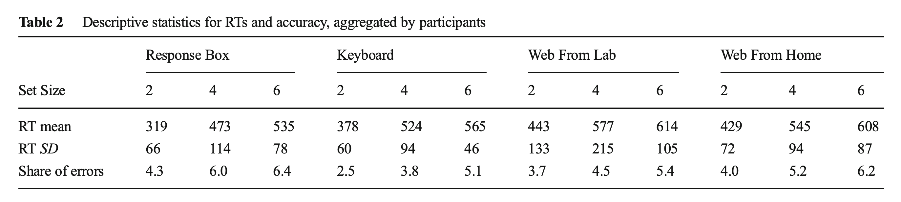
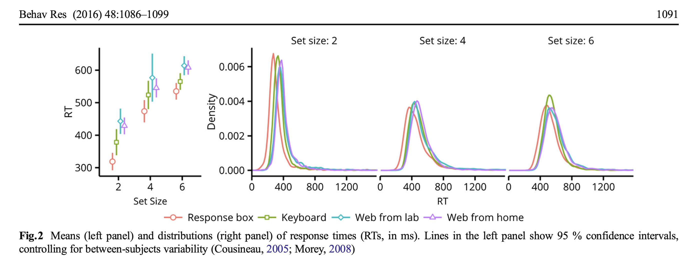
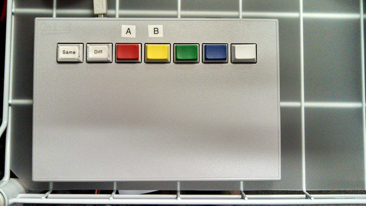
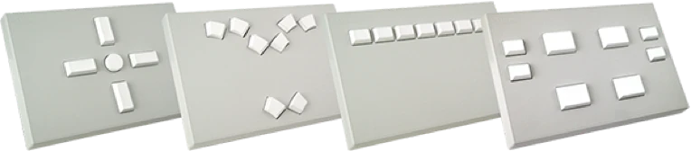
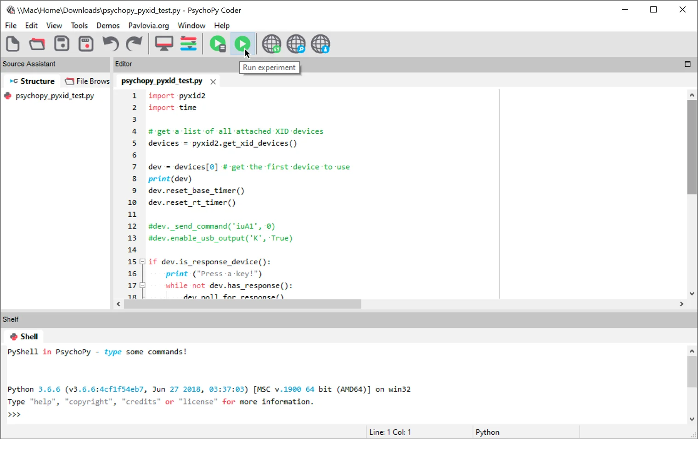

# PsychoPy:反应盒精确记时/Cedrus Box

Jibo He, Ph.D.
Department of Psychology, Tsinghua University
hejibolaboratory@pku.org.cn

---
# 反应盒与键盘Response box vs. keyboard
## 两者的反应时精度的差异
# 2-3ms vs. 10-12ms

“ Get 2-3 millisecond RT resolution. The resolution of a USB keyboard driver is 10-12ms and the hardware could make it worse.”

https://www.cedrus.com/rb_series/index.htm

---
# 反应盒与键盘Response box vs. keyboard

Source: Plant, R. R. (2016). 

---
# 反应盒与键盘Response box vs. keyboard

Source: Plant, R. R. (2016). 


---
# 反应盒的类型
- Cedrus box (supported by PsychoPy)
- SRBox (for Eprime)
---
# Cedrus 反应盒
- Cedrus 7-button response pad



---
# Cedrus 反应盒
 


---
# Cedrus 安装驱动

## INSTALLING AN RB SERIES PAD
The RB-x40 generation response pads introduce a new Keyboard mode. For better timing, experimental software like SuperLab use Standard mode instead and need to have a USB driver installed:

▪ Installing the USB Driver for Mac OS X
▪ Installing the USB Driver for Windows
▪ Installing the USB Driver for Linux
# https://ftdichip.com/drivers/d2xx-drivers/


---
# Cedrus 提供的PsychoPy示例代码
https://cedrus.com/support/rb_series/tn1551_psychopy.htm

```python
import pyxid2
import time

# get a list of all attached XID devices
devices = pyxid2.get_xid_devices()

dev = devices[0] # get the first device to use
print(dev)
dev.reset_base_timer()
dev.reset_rt_timer()

#dev._send_command('iuA1', 0)
#dev.enable_usb_output('K', True)

if dev.is_response_device():
    print ("Press a key!")
    while not dev.has_response():
        dev.poll_for_response()

    response = dev.get_next_response()
    print(response)
    dev.clear_response_queue()

dev.set_pulse_duration(300)

sleep_flash = .3
for bm in range(0, 16):
    mask = 2 ** bm
    print("activate_line bitmask: ", mask)
    #dev.activate_line(lines=[1,3,5,7,9,11,13,15])
    dev.activate_line(bitmask=mask)

    time.sleep(sleep_flash)
```
---
# Run Cedrus box for PSYCHOPY in WINDOWS



---
# 示例代码得到Cedrus box反应时
```python
import pyxid2 as pyxid

# get a list of all attached XID devices
devices = pyxid.get_xid_devices()

dev = devices[0] # get the first device to use
if dev.is_response_device():
    dev.reset_base_timer()
    dev.reset_rt_timer()

    while True:
        dev.poll_for_response()
        if dev.response_queue_size() > 0:
            response = dev.get_next_response()
            # do something with the response
```

---
# How to Cite Cedrus Box in your paper?

"The experiment was run on a Windows 7 PC. In the odor identification and rating tasks, participants responded with the mouse. In the categorization task, they responded with a Cedrus RB-740 Response Box (Cedrus Corporation)."

Source: Thomas Hörberg, et al.(2020)

---
# 使用反应盒的参考论文:
Thomas Hörberg, Maria Larsson, Ingrid Ekström, Camilla Sandöy, Peter Lundén, Jonas K Olofsson, Olfactory Influences on Visual Categorization: Behavioral and ERP Evidence, Cerebral Cortex, Volume 30, Issue 7, July 2020, Pages 4220–4237, https://doi.org/10.1093/cercor/bhaa050


---
# 精确计时参考文献

Plant, R. R. (2016). A reminder on millisecond timing accuracy and potential replication failure in computer-based psychology experiments: An open letter. Behavior Research Methods, 48(1), 408-411.

---
# References:

## PsychoPy
- https://www.psychopy.org/api/hardware/cedrus.html

## Cedrus
- https://github.com/cedrus-opensource/pyxid
- https://cedrus.com/support/rb_series/index.htm
- https://cedrus.com/support/rb_series/tn1551_psychopy.htm

- https://phon.wordpress.ncsu.edu/lab-manual/perception-experiments/