# PsychoPy系列讲座3: 使用代码生成各种刺激与被试反应

## by Jibo He/何吉波

清华大学社会科学学院心理学系
hejibolaboratory@pku.org.cn
version:2022-05-22

---
# Outline


- text (English and Chinese)
- show instruction
- image
- shapes
- audio
- Video
- Scale
- load data source
- write data to file
- Mouse response
- Keyboard response

---
# Show text

```python
    from psychopy import visual, core, event
    #create a window to draw in
    myWin = visual.Window((800.0,800.0),allowGUI=False,winType='pyglet',
        monitor='testMonitor', units ='deg', screen=0)
    myWin.setRecordFrameIntervals()
    #INITIALISE SOME STIMULI
    psychopyTxt = visual.TextStim(myWin, color='#FFFFFF',
                text = u"PsychoPy is a GREAT tool",
                units='norm', height=0.1,
                pos=[0.5, 0.5], alignHoriz='right',alignVert='top')

    psychopyTxt.draw()
    myWin.flip()
    #pause, so you get a chance to see it!
    core.wait(5.0)
```
<center><font size=4>Source code file: showText.py</font></center>

---
# Color Property
- color='#FFFFFF'
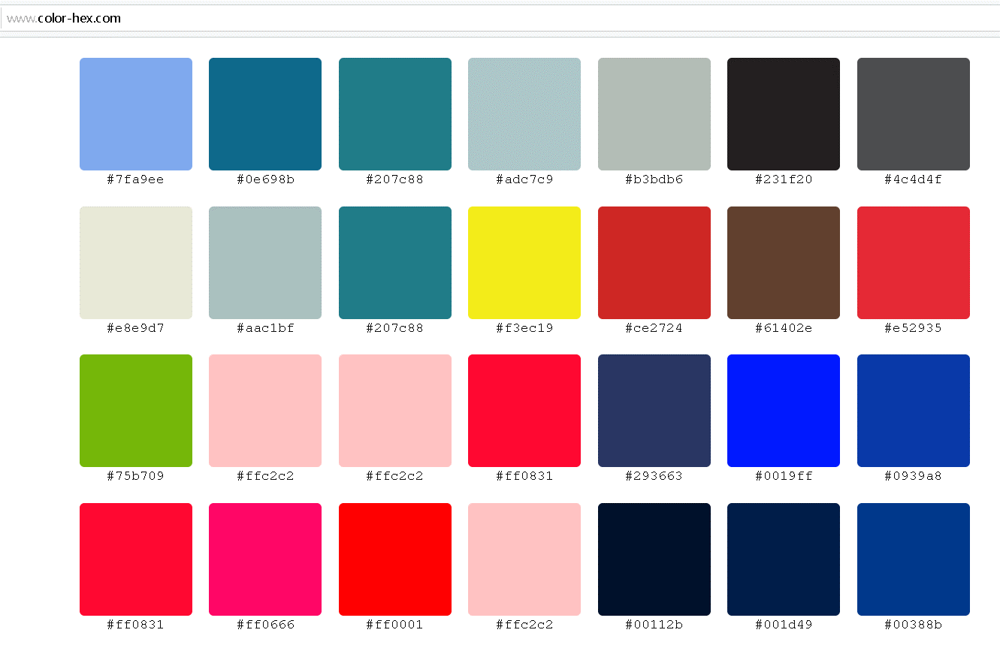

<center><font size=4>References: https://www.color-hex.com</font></center>

---
# Color Property
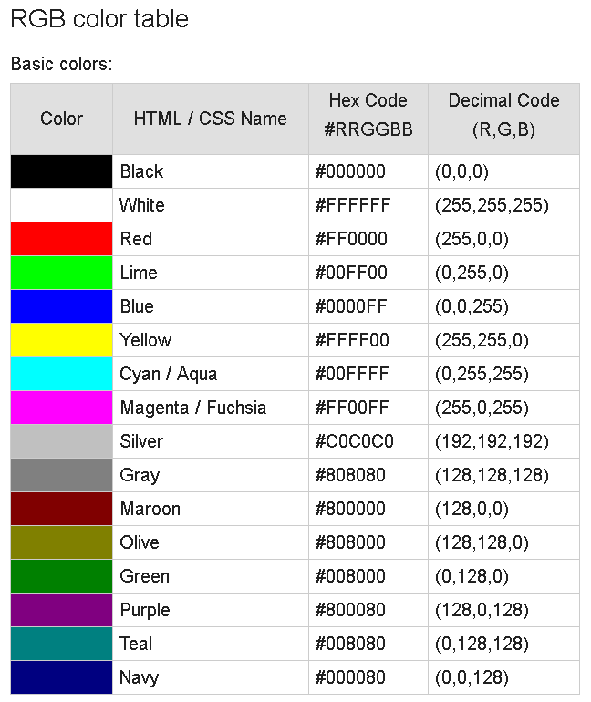

---
# Color Property
- RGB pairs
- color=(255,0,0)
- (0,255,0)
- (0,0,255)
- (0,0,0)
- (255,255,255)

<rihgt><font size=4>https://www.rapidtables.com/web/color/RGB_Color.html</font></right>

---
# Coordinate System

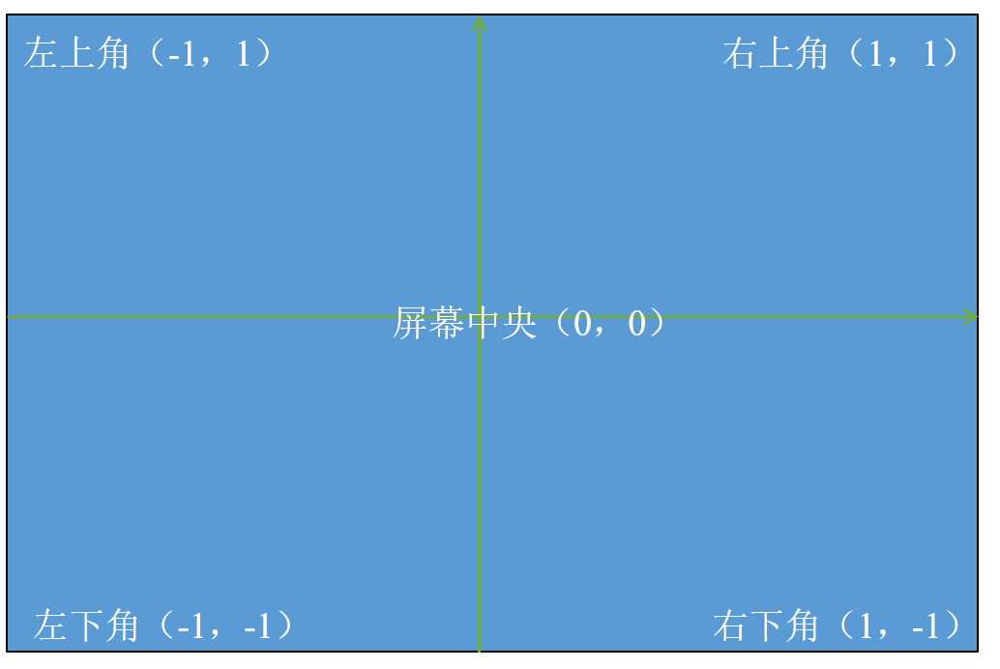

---
# Coordinate System

- center
    - (0,0)
- top right
    - (1,1)
- top left
    - (-1,1)
- bottom right
    - (1,-1)
- bottom left
    - (-1,-1)

---
# 秀/显示中文

```python
    # -*- coding: utf-8 -*-
    from psychopy.visual import Window, TextStim
    from psychopy import event

    win = Window(size=(600, 200), winType="pygame")
    a = TextStim(win, text=u"清华，你好", units='pix', height=55,
            font="simsun.ttf", pos=(0, 55))

    a.draw()
    win.flip()
    event.waitKeys(["space"])
```

<center><font size=4>Source code file:ChineseTextPresentation.py</font></center>

---
# Show Instruction
```python
    # !/usr/bin/env python2
    from psychopy import visual, core, event
    # create a window to draw in
    myWin = visual.Window((800.0, 800.0), allowGUI=False, winType='pyglet',
            monitor='testMonitor', units='deg', screen=0)
    myWin.setRecordFrameIntervals()
    # INITIALISE SOME STIMULI
    instruction = visual.TextStim(myWin, color='#FFFFFF',
            text=u'''         Instruction
    This is an experiment instruction. You need to do the following stuff.
    1. Fixate at the dot.
    2. press the 'Y' or 'N' key 
    Press any key to continue''',
            units='norm', height=0.1,
            pos=[0, 0.6], alignHoriz='center', alignVert='top')
    instruction.draw()
    myWin.flip()
    core.wait(5.0)
```

<center><font size=4>Source code file: showInstruction.py</font></center>

---
# End of Experiment
```python
    from psychopy import visual, core, event
    myWin = visual.Window((800.0, 800.0), allowGUI=False, winType='pyglet',
            monitor='testMonitor', units='deg', screen=0)
    myWin.setRecordFrameIntervals()
    EndofExperiment = visual.TextStim(myWin, color='#FFFFFF',
            text=u'''         Thank you!
    This is the end of the experiment. ''',
            units='norm', height=0.1,
            pos=[0, 0.6], alignHoriz='center', alignVert='top')

    EndofExperiment.draw()
    myWin.flip()
    core.wait(5.0)
```

<center><font size=4>Source code file: showEndofExperiment.py</font></center>

---
# Show Image
```python
    from psychopy import core, visual, event
    myWin = visual.Window((600,600), allowGUI=False, color=(-1,-1,-1),
        monitor='testMonitor',winType='pyglet', units='norm')
    myWin.setRecordFrameIntervals()
    faceRGB = visual.ImageStim(myWin,image='jibohe.PNG',
        mask=None,
        pos=(0.0,0.0),
        size=(1.0,1.0))
    faceRGB.draw()
    myWin.flip()
    core.wait(5.0)
```


<center><font size=4>Source code file: showImage.py</font></center>

---

# Shape-line
```python
    from psychopy import visual, core, event
    # create a window to draw in
    myWin = visual.Window((800.0, 800.0), allowGUI=False, winType='pyglet',
            monitor='testMonitor', units='deg', screen=0)
    myWin.setRecordFrameIntervals()

    # INITIALISE SOME STIMULI
    THoriLine = visual.Line(myWin, start=(0, 0), end=(2.8, 0))
    THoriLine.draw()

    TVertiLine = visual.Line(myWin, start=(0, 0), end=(0, 1.1))
    TVertiLine.draw()
    myWin.flip()

    # pause, so you get a chance to see it!
    core.wait(5.0)
```


<center><font size=4>Source code file: showLine.py</font></center>

---

# Shape – T versus L

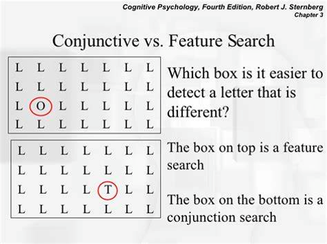

---
# Shape – line – tilted T
```python
    from psychopy import visual, core, event
    myWin = visual.Window((800.0,800.0),allowGUI=False,   winType='pyglet', monitor='testMonitor', units ='deg', screen=0)
    myWin.setRecordFrameIntervals()
    THoriLine = visual.Line(myWin, start=(-2.8, 0), end=(0, 2.8))
    THoriLine.draw()
    TVertiLine = visual.Line(myWin, start=(-1.4, 1.4), end=(2, -2))
    TVertiLine.draw()
    myWin.flip()
    core.wait(5.0)
```

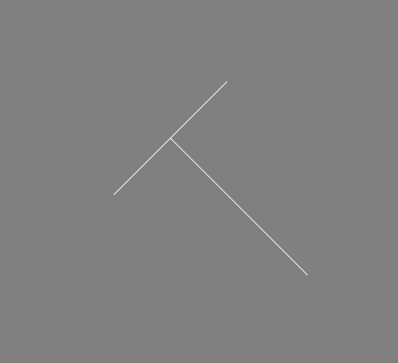

<center><font size=4>Source code file: Shape-T.py</font></center>

---
# Shape – line – tilted T
```python
    from psychopy import visual, core, event

    myWin = visual.Window((800.0, 800.0), allowGUI=False, winType='pyglet',
            monitor='testMonitor', units='deg', screen=0)
    myWin.setRecordFrameIntervals()
    square = visual.Rect(myWin, width=1, height=1)
    square.pos = (0, 0)
    square.draw()
    myWin.flip()
    core.wait(5.0)
```


<center><font size=4>Source code file: Shape-Square.py</font></center>

---

# Shape-circle
```python
    from psychopy import visual, core, event
    myWin = visual.Window((800.0,800.0),allowGUI=False,winType='pyglet',
        monitor='testMonitor', units ='deg', screen=0)
    myWin.setRecordFrameIntervals()
    circle = visual.Circle(myWin, radius=2, edges=32)
    circle.pos=(0,0)
    circle.draw()
    myWin.flip()
    core.wait(5.0)
```
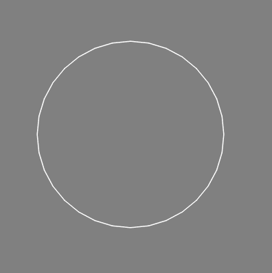

<center><font size=4>Source code file: Shape-circle.py</font></center>

---

# More complex stimuli

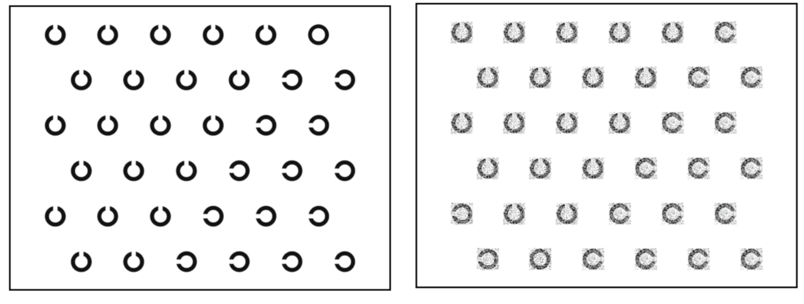

He, J. , & Mccarley, J. S. . (2010). Executive working memory load does not compromise perceptual processing during visual search: evidence from additive factors analysis. Attention Perception & Psychophysics, 72(2), 308-316.

---
# C versus O combined shapes
```python
    from psychopy import visual, core, event
    myWin = visual.Window((800.0,800.0),allowGUI=False,winType='pyglet’, color=(0, 0,0),monitor='testMonitor', units ='deg', screen=0)
    myWin.setRecordFrameIntervals()
    circle = visual.Circle(myWin, radius=2, edges=32)
    circle.pos=(0,0)
    circle.draw()
    square = visual.Rect(myWin, width=4,height=0.5,color=(0, 0, 0))
    square.pos=(0.5,0)
    square.draw()
    myWin.flip()
    core.wait(10.0)
```
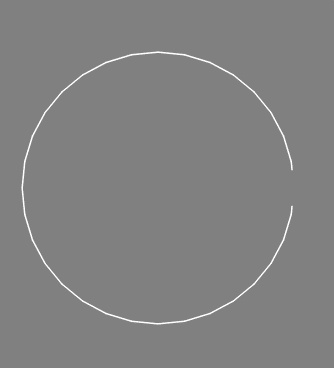


<center><font size=4>Source code file: Gapped C.py</font></center>

---
# Dotted C and O combined shapes
```python
    from psychopy import visual, core, event
    import random
    myWin = visual.Window((800.0,800.0),allowGUI=False,winType='pyglet',color=(0, 0, 0), monitor='testMonitor', units ='deg', screen=0)
    myWin.setRecordFrameIntervals()
    circle = visual.Circle(myWin, pos=(0,0),radius=2, edges=32)
    circle.draw()
    for i in range(500):
        x = random.random() * 4 - 2
        y = random.random() * 4 - 2
        circle = visual.Circle(myWin, pos=(x, y),radius=0.02, edges=32, color = (1,1,1))
        circle.draw()
    myWin.flip()
    core.wait(10.0)
```
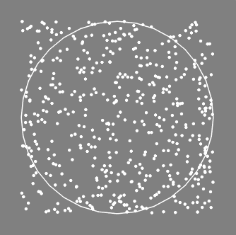

<center><font size=4>Source code file: dotttttsssss C2.py</font></center>

---

# Q versus O

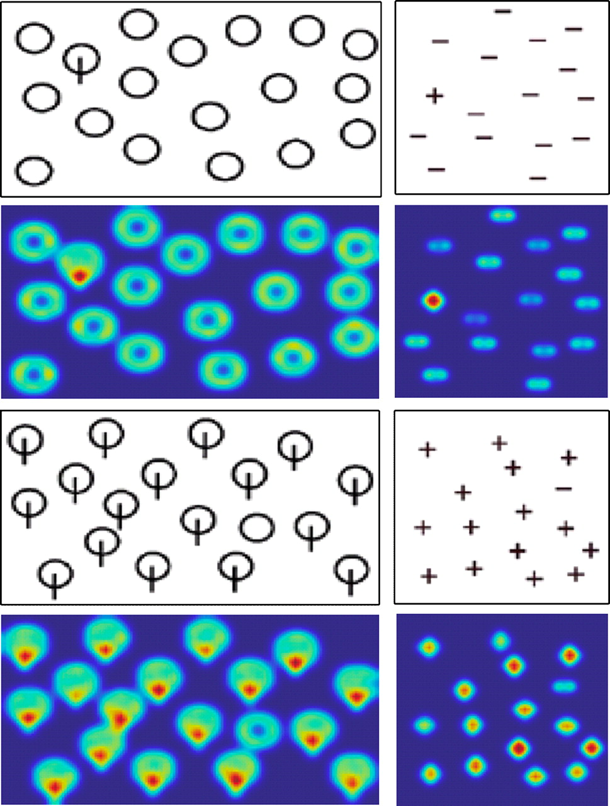

Seo, H. J. , & Milanfar, P. . (2009). Static and space-time visual saliency detection by self-resemblance. Journal of Vision, 9(12), 15-15.

---
# Q and O combined shapes
```python
    from psychopy import visual, core, event
    myWin = visual.Window((800.0,800.0),allowGUI=False,winType='pyglet', color=(0, 0, 0),monitor='testMonitor', units ='deg', screen=0)
    myWin.setRecordFrameIntervals()
    circle = visual.Circle(myWin, radius=2, edges=100,lineWidth=10)
    circle.pos=(0,0)
    circle.draw()
    TVertiLine = visual.Line(myWin, start=(0.5, -0.8), end=(2, -3))
    TVertiLine.draw()
    circlePositionList =[(-3,3),(4,4),(4,-4) ,(-4,-4)]
    for i in range(4):
        circle = visual.Circle(myWin, radius=1, edges=32)
        circle.pos=(circlePositionList[i][0], circlePositionList[i][1])
        circle.draw()
    myWin.flip()
    core.wait(10.0)
```
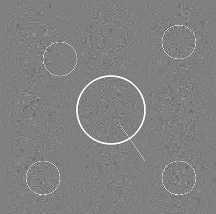

<center><font size=4>Source code file: QinOs.py</font></center>

---

# Audio
```python
    from psychopy import sound,core
    tada = sound.Sound('I_Believe_I_Can_Fly_sample.ogg')
    tada.play()
    core.wait(300)
```

<center><font size=4>Source code file: playAudio.py</font></center>

---

# Video
```python
    from psychopy import visual, core, event
    myWin = visual.Window((800.0,800.0),allowGUI=False,monitor='testMonitor', units ='deg', screen=0)
    myWin.setRecordFrameIntervals()
    mov = visual.MovieStim2(myWin, 'cry.mp4')
    mov.draw() # draw the current frame (automagically determined)
    myWin.flip()
    core.wait(5.0)
```

&ensp; 

<center><font size=4>Source code file: playVideos2pc.py</font></center>

---
# Scale
```python
    from psychopy import visual,event
    win = visual.Window()
    rating = visual.RatingScale(win=win, name='rating', marker=u'triangle', size=1.5, pos=[0.0, -0.4], low=1, high=7, labels=[u'不同意', u'中立', u'完全同意'], scale=u'你多大程度上赞同希拉里当选美国总统？')
    while rating.noResponse:
        rating.draw()
    win.flip()
    visual.TextStim(win, text = u"选了%d用了%.3f秒\n按空格退出" % (rating.getRating(), rating.getRT())).draw()
    win.flip()
    while 'space' not in event.getKeys():
       pass
    print(rating.getRating())
    print(rating.getRT())
    print(rating.getHistory())
```
<center><font size=4>Source code file: ScaleBuiltIn.py</font></center>

---

# Load data source
```python
    infile = open('datasource.csv','r')
    datasource ={}
    for line in infile.readlines()[1:]:
        trial,number = line.split(',')
        datasource[trial]=int(number.strip())
    print(datasource)
    infile.close()
    print('-_-!')
```

<center><font size=4>Source code file: loadDataSource.py</font></center>

---

# Write data file

```python
    outfile = open('experiment data file.txt','w')
    outfile.write('THIS IS A GREAT EXPERIMENT!')
    outfile.close()
    print('-_-!')
```

<center><font size=4>Source code file: WriteExperimentData.py</font></center>

---

# Get mouse inputs

```python
    from psychopy import core, visual, event
    win = visual.Window([300,300],color="black", units='pix')
    mouse = event.Mouse(win=win)
    mouse_pos = mouse.getPos()
    while True:
        if any(mouse.getPressed()): 
            #if any mouse button is pressed
            mouse_pos = mouse.getPos() 
            #get its position at time of button press
            break
    print('user clicked at', mouse_pos)
```

<center><font size=4>Source code file: getMouseInput.py</font></center>

---
# Show text until a mouse click
```python
    from psychopy import visual, core, event
    myWin = visual.Window((800.0,800.0),allowGUI=False,winType='pyglet', monitor='testMonitor', units ='deg', screen=0)
    myWin.setRecordFrameIntervals()
    psychopyTxt = visual.TextStim(myWin, color='#FFFFFF',
    text = u"PsychoPy is a GREAT tool",
    units='norm', height=0.1,
    pos=[0.5, 0.5], alignHoriz='right',alignVert='top')
    psychopyTxt.draw()
    myWin.flip()
    mouse = event.Mouse(win=myWin)
    if mouse:
        while True:
            if any(mouse.getPressed()): 
                #if any mouse button is pressed
                mouse_pos = mouse.getPos() 
                #get its position at time of button press
                break
            else:
                event.waitKeys()
```

<center><font size=4>Source code file: showTextUntilMouseClick.py</font></center>

---

# Get keyboard inputs
```python
    from psychopy import visual, core, event
    win = visual.Window(fullscr = False, size = (1000,600),color = (-1.0,-1.0,-1.0))
    text_1 = visual.TextStim(win, text = 'I love China', height = 0.12,pos = (0.0,0.2),bold = True,italic = False,color = 'pink')
    timer = core.Clock()
    text_1.draw()
    win.flip()
    core.wait(0)
    timer.reset() 
    k_1 = event.waitKeys()
    timeUse = timer.getTime() 
    print(k_1, timeUse)
```

<center><font size=4>Source code file: getKeyboardInputs.py
</font></center>

---

# Summary

Important Functions

- visual.TextStim
- visual.ImageStim
- visual.Line
- visual.Rect
- visual.Circle
- sound.Sound
- visual.MovieStim2
