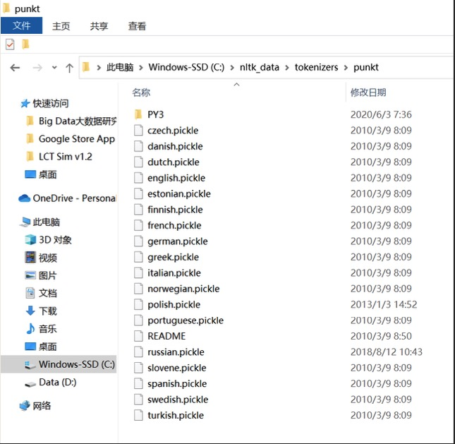
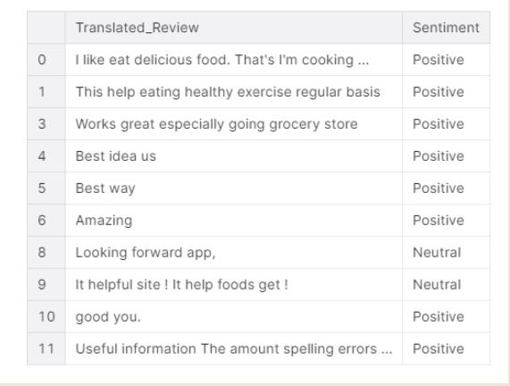
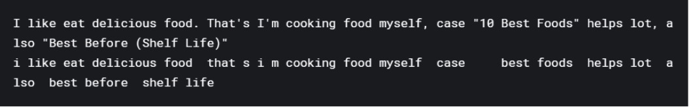
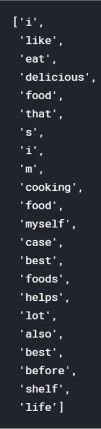
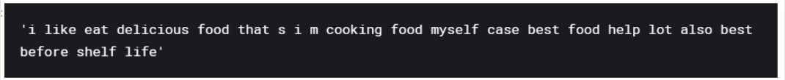
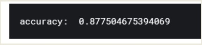
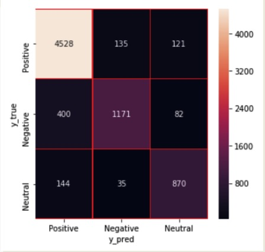

# PYTHON爬虫、大数据处理与商业智能
## 何吉波，博士 
## 清华大学社科学院
E-mail: hejibo666@Tsinghua.edu.cn

---
# 框架

### ■ 1. 爬虫，抓取RateMyProfessor.com
### ■ 2. 大数据可视化/商业智能 Microsoft Power BI
### ■ 3. 大数据分析

---

# 第一节 Python 网络爬虫
### Dr. Jibo He
### 清华大学社科学院心理学系

---
# 网络爬虫

**什么是网络爬虫**
**百科定义**:一种按照一定的规则,自动地抓取万维网信息的程序或者脚本。

**网络爬虫能做什么:**
数据获取,搜索引擎.

---
# 网络通信
 
### 简单过程
1.本地浏览器客户端)——请求一->服务器(服务端)
2本地浏览器客户端)<--文件数据一服务器服务端)
3.本地浏览器(客户端)进行解析文件数据并且展现。

# URL
**URL** :{ Uniform Resource Locator)统一资源定位符,即请求资源地址
URL组成:
### 基本上是由三部分组成
1协议(HTP呀,FTP呀~~等等
2主机的P地址(或者域名)
3请求主机资源的具体地址(目录,文件名等
**URL示例**
http://www.pku.edu.cn/academics/index.htm

---
# 下载一个网页
urllib2:是一个标准库，安装python之后就自带 http://docs.python.org/2.7/library/urllib2.html

    !python 
    import urllib2
    response = urllib2.urlopen('http://python.org/’) html = response.read()
    print response
    print html

---
# 模拟浏览器
### • 给爬虫添加User Agent 
### • 标识爬虫为特定身份

    !Python
    import urllib2
    request = urllib2.Request(‘http://ratemyprofessor.com/’) #注意大小写 request.add_header("User-Agent", "Mozilla/4.0 (compatible; MSIE 6.0; Windows NT 5.1; SV1; AcooBrowser; .NET CLR 1.1.4322; .NET CLR 2.0.50727)")
    opener = urllib2.build_opener()
    response = opener.open(request) # 获取服务器返回信息
    html = response.read()
    Print html

# 模拟浏览器

### • 添加暂停时间
### • 防止爬虫被服务器管理员封禁

    !Python
    for PageIndex in range(1901080,1901092): CrawlPage(PageIndex)
    if PageIndex%5 == 0:
    time.sleep(1) # 暂停 1 秒

---
# 数据保存

### • 存储获取的网页数据
    !python
    f = open('myfile.html', 'w') 
    f.write(html)
    f.close()

---
# 爬取ratemyprofessor
### 爬虫的四个主要步骤:

1. 明确目标 (要知道你准备在哪个范围或者网站去搜索) 
2. 爬 (将所有的网站的内容全部爬下来)
3. 取 (去掉对我们没用处的数据)
4. 处理数据
   
---
# 获得网页
    !python
    from bs4 import BeautifulSoup import cPickle as p1
    import urllib2

    url =‘http://www.ratemyprofessors.com/ShowRatings.jsp?tid=1901092’
    head = {}
    head['User-Agent'] = 'Mozilla/5.0 (Linux; Android 4.1.1; Nexus 7 Build/JRO03D) AppleWebKit/535.19 (KHTML, like Gecko) Chrome/18.0.1025.166 Safari/535.19’ req = urllib2.Request(url, headers=head)
    opener = urllib2.build_opener()
    html = pageFile.read().decode('utf-8’)
    reviewfile =r'C:\ratemyprofessor-product-review-1901092-page.data’ f = file(reviewfile, 'w')
    p1.dump(html, f) # dump the object to a file
    f.close()
    print 'finished page1901092’

---
# 获得网页
### 如何爬取多个网页:for loop, 模块化思维 
### 如何处理异常情况:try except

    !Python
    def CrawlPage(PageIndex): try:
    except:
    print '!!!!!!!!!!!!!!!!!!!!!!!!failed for %d page'%PageIndex
    for PageIndex in PageIndexs: CrawlPage(PageIndex)

---
# 获得网页
    !python
    def CrawlPage(PageIndex): try:
    url =‘http://www.ratemyprofessors.com/ShowRatings.jsp?tid=%s'%PageIndex’
    head = {}
    head['User-Agent'] = 'Mozilla/5.0 (Linux; Android 4.1.1; Nexus 7 Build/JRO03D)
    AppleWebKit/535.19 (KHTML, like Gecko) Chrome/18.0.1025.166 Safari/535.19’ req = urllib2.Request(url, headers=head)
    opener = urllib2.build_opener()
    html = pageFile.read().decode('utf-8’)
    reviewfile =r'C:\Users\Administrator\Desktop\ratemyprofessor-product-review-%d-
    page.data'%PageIndex
    f = file(reviewfile, 'w')
    p1.dump(html, f) # dump the object to a file f.close()
    print 'finished page:%s'%PageIndex
    except:
    print '!!!!!!!!!!!!!!!!!!!!!!!!failed for %d page'%PageIndex

---
# 读取数据
### 读取存储的网页
    !python
    reviewfile = r'C:\ratemyprofessor-product-review-1901092-page.data’ f = file(reviewfile)
    soup = p1.load(f)
    f.close()
    def LoadCachedPage(PageIndex):
    reviewfile = r'C:\ratemyprofessor-product-review-1901092-page.data’ f = file(reviewfile)
    soup = p1.load(f)
    f.close()
    return soup

---
# 提取数据
### 正则表达式:re 
### python内置模块

### 更方便的选择:BeautifulSoup
### 将爬取的网页内容自动解析成树形文件，便于查看和处理

---
# 提取数据
### 正则表达式

    ！python
    Import re
    

    7 Student Ratings 

    !python
    import re
    pattern = re.compile(r'<div.*?class="table-toggle rating- count active" .*? >(.*?)
', re.S)
    Num_students= pattern.findall(html)

---
# 提取数据
**BeautifulSoup安装**
**下载安装包进行安装**
https://pypi.org/project/beautifulsoup4/ pip install BeautifulSoup4

    !python
    Python >>>Import bs4
    Pip list

# 提取数据

使用beautifulsoup http://beautifulsoup.readthedocs.io/zh_CN/v4.4.0/

from bs4 import BeautifulSoup
soupParsed = BeautifulSoup(html)
Schoolname = soupParsed.find("h2",{"class":"schoolname"}).text Num_students = soupParsed.find("div", {"class":"table-toggle rating-count active"}).text

# 提取数据
    !python
    def getNames(soup):
    soupParsed = BeautifulSoup(html)
    active"})
    Num_students = soupParsed.find("div", {"class":"table-toggle rating-count
    if Num_students is None: Num_students = []
    else:
    Num_students = Num_students .text[:-16] Schoolname = soupParsed.find("h2",{"class":"schoolname"}).text
    if Schoolname is None: Schoolname = []
    else:
    return Num_students, Schoolname
    Schoolname = soupParsed.find("h2",{"class":"schoolname"})

# 存储数据

### 存储从网页中提取的数据

    !python
    datanames = [‘Schoolname’,’Num_students’] 
    datafiletxt = open(‘RateMyprofessor_data.txt’,’a’) 
      for names in range(len(datanames)):
    datafiletxt.write(str(datanames[names])+ ‘\t’) datafiletxt.write('\n’)

    def Data_save(content,filename,mode=‘a’): 
              file = open(filename,mode)
              for i in range(len(content)): 
              file.write(str(content[i])+’\t’)
              file.write(‘\n’) file.close()

# 爬取大量网页
## 爬取存储网页
 for PageIndex in range(1901080,1901093): 
              CrawlPage(PageIndex)
              soup = LoadCachedPage(PageIndex)
              datalist = getNames(soup) 
              Data_save(datanames,’RateMyprofessor_data.txt’)

# 总结
**爬取存储网页**: CrawlPage(PageIndex) 
**读取提取数据**: LoadCachedPage(PageIndex)
                GetNames(soup)
**存储提取数据**: Data_save(content,filename,mode='a')

---
# 第二节
## 大数据可视化/商业智能 
## Microsoft Power BI
### Dr. Jibo He
### 清华大学社科学院心理学系

---
# 第三节
# 大数据分析，自然语言处理与机器学习
### Dr. Jibo He
### 清华大学社科学院心理学系

---
# Install all required packages

■ #bacth installer for python for big data lecture
■ pip install numpy
■ pip install pandas
■ pip install seaborn
■ pip install matplotlib
■ pip install nltk
■ pip install sklearn
■ pip install wordcloud ■
 #natural language processing for the Chinese language 
■ pip install jieba

---
# Configure nltk and its data

■ #https://www.jianshu.com/p/ab7564be5a2b
■ #https://www.cnblogs.com/webRobot/p/6065831.html
■ #stopwords (irrelavent words)
■ import nltk
■ #nltk.download("stopwords")
■ from nltk.corpus import stopwords
■ text = "i like eat delicious food that s i m cooking food myself case best foods helps lot also best before shelf life "
■ text=nltk.word_tokenize(text) #separate all words
■ print(text) ■

---
# Configure nltk and its data

■ Resource punkt not found.
■ Please use the NLTK Downloader to obtain the resource:
■ >>> import nltk
■ >>> nltk.download('punkt') 
■ For more information see: https://www.nltk.org/data.html
■ Attempted to load tokenizers/punkt/english.pickle

---
# Step 1. List all the files

    !Python
    import numpy as np # linear algebra
    import pandas as pd # data processing, CSV file I/O (e.g. pd.read_csv) import matplotlib.pyplot as plt
    import os
    (os.listdir("./input data"))

---
# Step 2. Read the review data

 data=pd.read_csv("./input data/googleplaystore_user_reviews.csv",encoding="latin1") data.head()
  [!python](pic9.jpg)

---
# Step 3. Select reviews and types of reviews

■ df=pd.concat([data.Translated_Review,data.Sentiment],axis=1) 
■ df.dropna(axis=0,inplace=True)
■ df.head(10)
■ print(df.Sentiment.value_counts())

---
# Step 4. Converting review types to int

■ Converting review types to int form in order to use classification methods.
■ 0= Positive, 1=Negative, 2= Neutral

    !python
    df.Sentiment=[0 if i=="Positive" else 1 if i== "Negative" else 2 for i in df.Sentiment] df.head(10)
---
# Step 5. text data cleaning

    !python
    #Data cleaning
    import re
    first_text=df.Translated_Review[0]
    text=re.sub("[^a-zA-Z]"," ",first_text) #changing characters with space text=text.lower()
    print(df.Translated_Review[0]) #lets review of changings
    print(text)

---
# Step 6. Stop word removal

    !Python
    #stopwords (irrelavent words)
    import nltk
    #nltk.download("stopwords") #nltk.download("punkt")
    from nltk.corpus import stopwords text=nltk.word_tokenize(text) #separate all words print(text)

---
# Step 7.1. word lemmatization

What is lemmatization??? With lemmatization we can convert words to their root format.
For instance books--->book

    !python
    import nltk as nlp lemma=nlp.WordNet
    Lemmatizer() 
    text=[lemma.lemmatize(i) for i in text] 
    text=" ".join(text)
    print(text)

---
# Step 7.2. word lemmatization
**Lemmatization all review texts**

    !python
    text_list=[]
    for i in df.Translated_Review:
    text=re.sub("[^a-zA-Z]"," ",i) text=text.lower() text=nltk.word_tokenize(text) lemma=nlp.WordNetLemmatizer()
    text=[lemma.lemmatize(word) for word in text] text=" ".join(text)
    text_list.append(text)

---
# Step 8. Bag of words algorithm

    !python
    #bag of words
    from sklearn.feature_extraction.text
    import CountVectorizer
    max_features=200000 cou_vec=CountVectorizer(max_features=max_features,stop_words="english") sparce_matrix=cou_vec.fit_transform(text_list).toarray() all_words=cou_vec.get_feature_names()
    print("Most used words: ",all_words[50:100])

---
# Step 9. Visualize using wordcloud

    !python
    from wordcloud import WordCloud
    plt.subplots(figsize=(12,12)) wordcloud=WordCloud(background_color="white",width=1024,height=768).generate(" ".join(all_words[100:])) plt.imshow(wordcloud)
    plt.axis("off")
    plt.show()

---
# Step 10. Machine learning (Part 1): split data

    !python
    #classification
    y=df.iloc[:,1].values
    x=sparce_matrix
    from sklearn.model_selection
    import train_test_split x_train,x_test,y_train,y_test=train_test_split(x,y,test_size=0.2,random_state=42)
    

---
# Step 10. Machine learning (Part 2): Random Forest algorithm

    !python
    #Random Forest
    from sklearn.ensemble import RandomForestClassifier
    rf = RandomForestClassifier(n_estimators = 10, random_state=42) rf.fit(x_train,y_train)
    print("accuracy: ",rf.score(x_test,y_test))

---
## Step 10. Machine learning (Part 3): Confusion matrix

    !python
    y_pred=rf.predict(x_test)
    y_true=y_test
    from sklearn.metrics import confusion_matrix
    import seaborn as sns
    names=["Positive","Negative","Neutral"] cm=confusion_matrix(y_true,y_pred)
    f,ax=plt.subplots(figsize=(5,5)) sns.heatmap(cm,annot=True,linewidth=.5,linecolor="r",fmt=".0f",ax=ax) plt.xlabel("y_pred")
    plt.ylabel("y_true")
    ax.set_xticklabels(names)
    ax.set_yticklabels(names)
    plt.show()

---
# Potential issues: MemoryError

!python

■ Traceback (most recent call last):

■ File "c:/Users/Researcher/Desktop/Course/工程心理学专题/Big Data大数据研究/Google Store App Rating User Experience/TextProcessingNLP.py", line 89, in <module>

■ x_train,x_test,y_train,y_test=train_test_split(x,y,test_size=0.2,random_state=42)

■ File"C:\Users\Researcher\AppData\Local\Packages\PythonSoftwareFoundation.Python.3.8_qbz5n2kfra8p0\LocalCache\local-packages\Python38\site-packages\sklearn\model_selection\_split.py", line 2154, in train_test_split

■ return list(chain.from_iterable((_safe_indexing(a, train),

■ File"C:\Users\Researcher\AppData\Local\Packages\PythonSoftwareFoundation.Python.3.8_qbz5n2kfra8p0\LocalCache\local-packages\Python38\site-packages\sklearn\model_selection\_split.py", line 2154, in <genexpr>

■ return list(chain.from_iterable((_safe_indexing(a, train),

■ File"C:\Users\Researcher\AppData\Local\Packages\PythonSoftwareFoundation.Python.3.8_qbz5n2kfra8p0\LocalCache\local-packages\Python38\site-packages\sklearn\utils\__init__.py", line 395, in _safe_indexing

■ return _array_indexing(X, indices, indices_dtype, axis=axis)

■ File "C:\Users\Researcher\AppData\Local\Packages\PythonSoftwareFoundation.Python.3.8_qbz5n2kfra8p0\LocalCache\local-packages\Python38\site-packages\sklearn\utils\__init__.py", line 181, in _array_indexing

■ return array[key] if axis == 0 else array[:, key]

■ **MemoryError: Unable to allocate 3.88 GiB for an array with shape (29941, 17404) and data type int64**

■ PS C:\Users\Researcher\Desktop\Course\工程心理学专题\Big Data大数据研究\Google Store App Rating User Experience>

---
# Potential issues: MemoryError

##  **■ MemoryError: Unable to allocate 3.88 GiB for an array with shape (29941, 17404) and data type**

---
