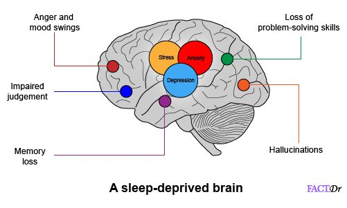

<!-- page_number: true -->
# Lecture 2. Visualization of fMRI data in Python: A sleep deprivation case
## 《大数据与多模态》
Dr. Jibo He
Tsinghua University


---
# 课程目的

- 讲述fMRI的原理
- fMRI的可视化
- 基于驾驶，讲解fMRI的代表性研究

---
# 软件包安装

```python
pip install nilearn
```

---
# fMRI Data Analysis Pipeline Management in Python
## Analysis Pipeline Management
  - nipype - Provides a uniform interface to existing neuroimaging software.
## Computational Anatomy
  - dipy - Focuses on diffusion magnetic resonance imaging (dMRI) analysis.
  - mindboggle - Improves the accuracy, precision, and consistency of labeling & morphometry of brain imaging data.

---
# fMRI Data Analysis Pipeline Management in Python
## File I/O and Data Management
  - nibabel - Read / write common neuroimaging file formats.
  - Scitran SDM - Delivers efficient and robust archiving, organization, and sharing of scientific data.
## Functional MRI
  - Nipy - Analysis of structural and functional neuroimaging data.
  Nitime - Time-series analysis of neuroscience data.
  popeye - Population receptive field estimation
  
---
# fMRI Data Analysis Pipeline Management in Python

## Machine Learning
  - Nilearn - Fast and easy statistical learning on neuroimaging data.
  - PyMVPA - Eases statistical learning analyses of large neuroimaging datasets.
## Human Electrophysiology
  - MNE - Processes magnetoencephalography (MEG) and electroencephalography (EEG) data.
## Data Visualisation
  - napari-nibabel - A plugin for the napari image viewer to view and annotate neuroimaging data
  niwidgets - Provides interactive plots for volumetric images.

---
# 示例图像


---
# 代码

```python

    from lib2to3.pgen2 import pgen
    from nilearn import datasets

    atlas_data = datasets.fetch_atlas_msdl()
    atlas_filename = atlas_data.maps

    from nilearn import plotting, image

    ### First plot the map for the PCC: index 4 in the atlas
    display = plotting.plot_stat_map(image.index_img(atlas_filename, 4),
                                    colorbar=False,
                                    title="DMN nodes in MSDL atlas")
    ### Now add as an overlay the maps for the ACC and the left and right
    ### parietal nodes
    display.add_overlay(image.index_img(atlas_filename, 5),
                        cmap=plotting.cm.black_blue)
    display.add_overlay(image.index_img(atlas_filename, 6),
                        cmap=plotting.cm.black_green)
    display.add_overlay(image.index_img(atlas_filename, 3),
                        cmap=plotting.cm.black_pink)

    plotting.show()
```

---
# sleep deprived brain


---
# sleep deprived brain


---
# sleep deprived brain


---
# sleep deprived brain

## based on the paper. 


---
# Data availability:
## Behavioral, EMG, heart rate and pupil data. 
- https://doi.org/10.5281/zenodo.3821968
## Statistical images of main analyses
- https://neurovault.org/collections/RLWUZRQN
## raw imaging data　of fMRI
- https://openneuro.org/datasets/ds000201

---
# valuable references
https://nipy.org/

---
# Exampliar paper with data

[1](2020). A combined fmri and emg study of emotional contagion following partial sleep deprivation in young and older humans. Scientific Reports, 10(1).