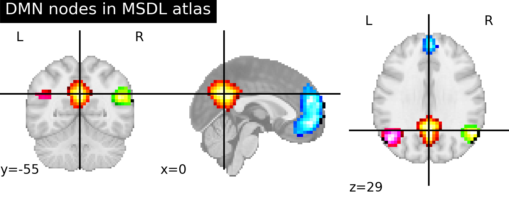

<!-- page_number: true -->
# Lecture 2. Visualization of fMRI data in Python
## 《大数据与多模态》
Dr. Jibo He
Tsinghua University

---
# 课程目的

- 讲述fMRI的原理
- fMRI的可视化
- 基于驾驶，讲解fMRI的代表性研究

---
# 软件包安装

```python
pip install nilearn
```

---
# 示例图像


---
# 代码

```python

    from lib2to3.pgen2 import pgen
    from nilearn import datasets

    atlas_data = datasets.fetch_atlas_msdl()
    atlas_filename = atlas_data.maps

    from nilearn import plotting, image

    ### First plot the map for the PCC: index 4 in the atlas
    display = plotting.plot_stat_map(image.index_img(atlas_filename, 4),
                                    colorbar=False,
                                    title="DMN nodes in MSDL atlas")
    ### Now add as an overlay the maps for the ACC and the left and right
    ### parietal nodes
    display.add_overlay(image.index_img(atlas_filename, 5),
                        cmap=plotting.cm.black_blue)
    display.add_overlay(image.index_img(atlas_filename, 6),
                        cmap=plotting.cm.black_green)
    display.add_overlay(image.index_img(atlas_filename, 3),
                        cmap=plotting.cm.black_pink)

    plotting.show()

--- 
# fMRI用于驾驶研究

样例论文-identifying core affect in individuals from fMRI responses

